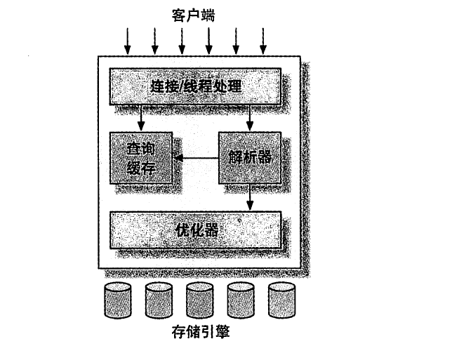
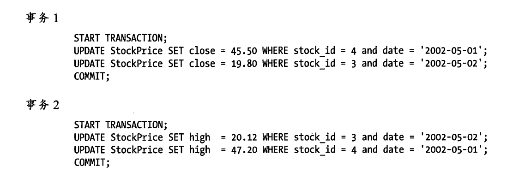
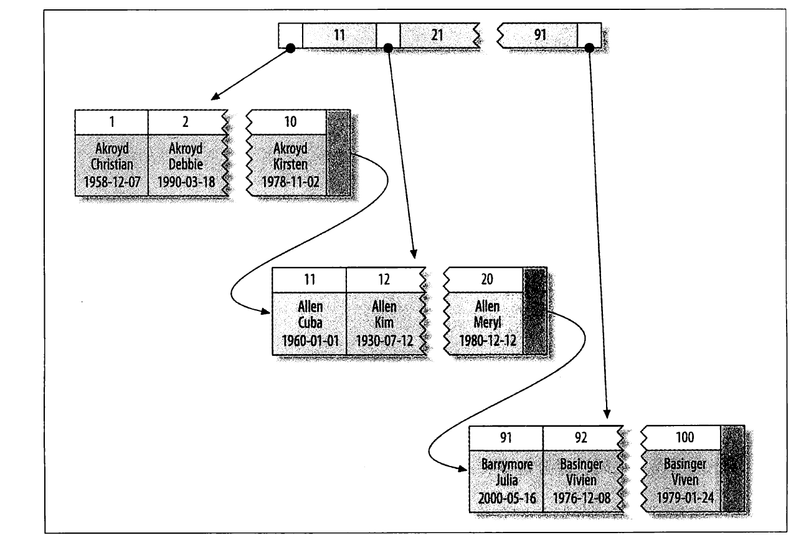
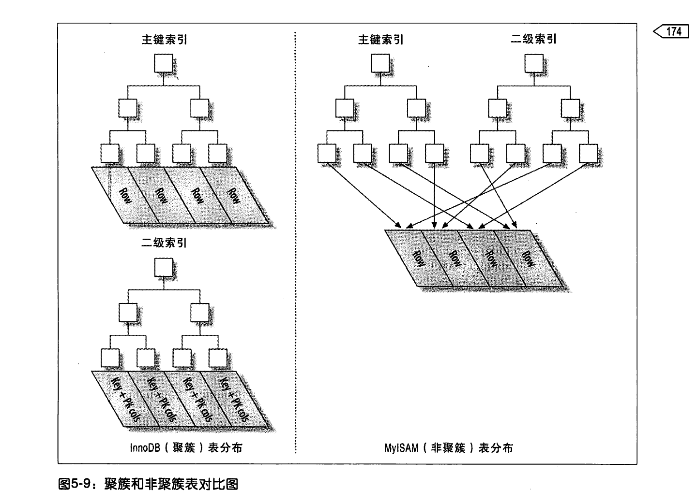
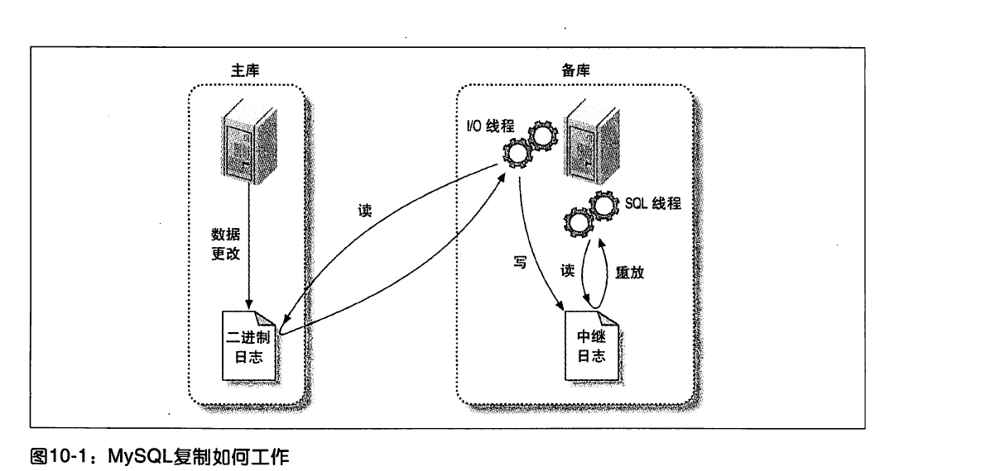

# 高性能Mysql

# 1.Mysql架构与历史 
## Mysql逻辑图


分为两部分
1. Mysql服务器：包含连接/线程管理器、查询缓存、解析器、优化器
2. 存储引擎:MyISAM、InnoDb

## 事务隔离级别

1. READ UNCOMITTED(未提交读)
表示事务没有提交，对其他事务也是可见的。事务可以读取未提交的数据，脏读，问题很多很少使用。

2. READ COMITTED(提交读)
一个事务只能看见已经提交的事务所做的修改。不可重复读，两次同样的查询得到的结果可能不同。大多数数据库的默认隔离级别都是这个，Mysql不是。

3. REPTEATED READ(可重复读)  
保证了同一个事务中多次读到的数据相同。Mysql的默认事务隔离级别。

4. SERIALIZABLE(可串行化)
最高的事务隔离级别，SERIALIZABLE在读取每一行的时候都会加锁，所以可能导致大量的超时和锁争用问题。


MySQL可以通过命令:SET TRANSACTION ISOLATION LEVEL来设置隔离级别。

## 死锁


如果凑巧两个事务都执行了第一条UPDATE，更新了一跳数据，同时也锁定了该行（行级锁），接着尝试执行第二条UPDATE时，缺发现改行已经被对方锁定，死循环。

Innodb立即返回错误，并将持有最少航迹排他锁的事务回滚。


# 2.MySQL基准测试

## 测试指标
吞吐量、响应时间或者延迟、并发性、可扩展性。

## MySQL基准测试的工具
1. ab
2. http_load
3. JMeter

#3. 服务器性能剖析

完成一项任务所需要的时间可以发分为两部分:执行时间(slowlog)和等待时间。


# Schema与数据类型优化

## 数据类型选择原则
1. 更小的通常更好
2. 简单就好
3. 尽量避免NULL   
*通常最好指定列为NOT NULL，除非真的需要存储NULL值*
如果查询中包含可谓NULL的列时，对MySQL来说更难优化，因为可为NULL的列是的索引、索引统计和值比较都更加复杂。可为NULL的列会使用更多的存储空间，在MYSQL里也需要特殊的处理，当可为NULL的列被索引时，每个索引记录记录都需要一个额外的字节，在MYISAM里甚至还可能导致固定大小的索引变成可变大小的索引。

*通常把可为NULL的列改为NOT NULL带来的性能提升比较小，所以调优时没必要首先改掉这种情况，除非确定这行会导致问题，但是，如果计划在该列建索引，就应该避免设计可为NULL的列*

尽量只在对小数进行精确计算时才使用DECIMAL---例如存储财富数据。但当数据量比较大时，可以考虑用BIGINT代替DECIMAL，将需要存储的货币单位根据小数的位数诚意对应的倍数即可。

*慷慨是不明智的：*使用VACHAR(5)和VCHAR(200)存储'hello'的空间开销是一样的，但是更长的列会消耗更多的内存，因为MySQL通常会分配固定的大小的内存块来保存内布值。油漆是使用内存临时表进行排序或者操作的时候会特别糟糕。


*ORDER BY或者 GROUP BY 会生成临时表，所以对较长的字符串一定不要使用！！！！*

*除特殊行为之外，通常应该尽可能的使用TIMESTAMP，因为它比DATETIME空间效率更高！！*


## MySQL设计中的陷阱
1. 太多的列 

2. 太多的关联

3. 全能的枚举

4. 变相的枚举


# 高效索引

不用将字符串的全部作为索引，部分前缀索引可以提高效率。


如Add key(city(7))

## 聚簇索引：
实际数据行存放在索引的叶子页中。即数据存储在索引的叶子中，如下图：



InnoDB通过主键聚集数据，也就是InnoDB的数据行存储在 主键索引的叶子中。如果没有主键，InnoDB会选择一个唯一的非空索引来替代。如果没有这样的索引，InnoDB会隐式定义一个主键来作为聚簇索引。

聚簇索引的优点：
1. 可以把相关数据保存在一起
2. 数据访问更快，索引和数据保存在B-Tree中，取数据比非聚簇索引快
3. select * 可以直接使用叶子节点的主键值

聚簇索引的缺点:
1. 聚簇索引提高了I/O效率，但是如果数据都在内存中，就没有什么优势了。
2. 插入速度严重依赖插入顺序。按主键插入是加载到InnoDB最快的方式。
3. 更新聚簇索引列的代价很高，因为强制InnoDB将每个被更新的行移动到新的位置。
4. 基于聚簇索引的表在插入新行，或者主键被更新导致需要移动时，可能导致"页分裂"问题。
5. 可能导致全表扫描比较慢，尤其是行比较稀疏时
6. 二级索引（非聚簇索引）可能比想象的要大，因为二级索引的叶子节点包含了引用行的主键列。
7. 二级索引访问需要两次索引查找，首先查二级索引找到主键行索引，再通过主键行索引找到数据。



**最好使用顺序索引，要避免随机的聚簇索引**

## 如何确定索引的顺序

    如两列a,b,如何确定是建立key(a,b)好还是key(b,a)好，应该 计算选择性大的作为索引。

    select sum(group by(a))/count(*)
    select sum(group by(b))/count(*)

    哪个大选哪个，这样在索引第一层就可以取出尽可能少的数据。 

## 覆盖索引

覆盖索引用通俗的话讲就是在select的时候只用去读取索引而取得数据，无需进行二次select相关表。这样的索引的叶子节点上面也包含了他们索引的数据。

由于InnoDB的聚簇索引，覆盖索引对InnoDB特别有用。InnoDB的二级索引在叶子节点保存了行的主键值，所以二级主键能够覆盖查询。

当发起一个被索引覆盖的查询时，expain的extra列可以看到"Using Index"的信息。


## 使用索引来做排序

**索引都是正序排序的，如果用desc，就不能用索引**

## 如何用覆盖索引查询

**先利用覆盖索引查出<primary key cols>，在Inner join**

```SQL

SELECT <cols> FROM profiles INNER JOIN (
        SELECT <primary key cols> FROM profiles
        where x.sex = 'M ORDER BY rating LIMIT 100000,10
 )

```

# 查询优化

## 一个复杂查询还是多个简单查询

MySQL从设计上让连接和断开连接都很轻量级，在返回一个小的查询结果方面很高效。所以不惧怕把复杂的查询换成多个简单的查询。

## 区分查询
将大查询切分成小查询，每个查询功能完全一样，只完成一小部分，每次只返回一小部分结果。

例如 delete from message where created < DATE_SUB(NOW(),INTERVAL 3 MONTH) 

可以写成如下

```SQL
rows_affected = 0
do{
    rows_affected = do_query(
        "delete from message where created < DATE_SUB(NOW(),INTERVAL 3 MONTH) limit 10000"
    )
}
```

每次删除10000条，分多次来执行，减少锁的持有时间。


## 分解关联查询

```SQL
select * from tag 
    JOIN tag_post ON tag_post.tag_id = tag.id
    JOIN post on tag_post.post_id = post.id
```

分解成：

```SQL
select * from tag where tag = 'mysql';
select * from tag_post where tag_id = 1234;
select * from post where post.id in (123,245);
```

优点：
1. 让缓存效率更高。

2. 将查询分解后，执行单个查询可以减少锁竞争。

3. 在应用层做关联，可以容易对数据库进行拆分，更容易做到高性能和扩展性。

4. 查询本身效率也会有所提升。（索引）

5. 可以减少冗余的查询。减少网络和内存消耗量。

## 不要将复杂的条件作用于 列

例如: select * from test where id + 1 = 2   
会比select * from test where id  = 1慢，SQL1不能使用索引。


# 复制
